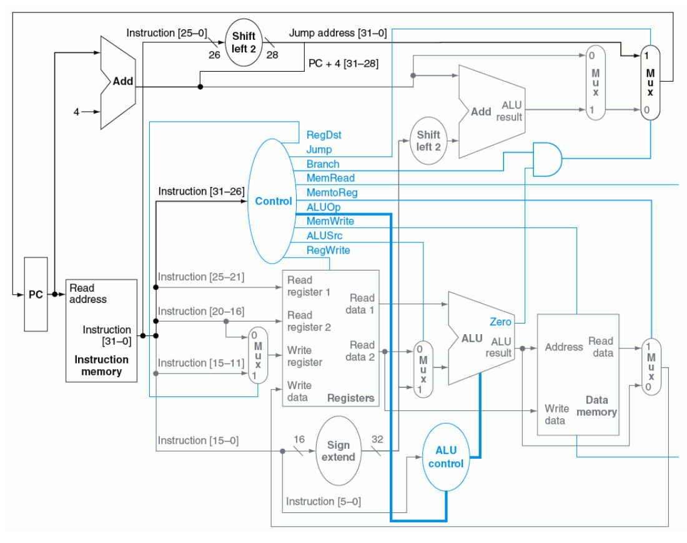
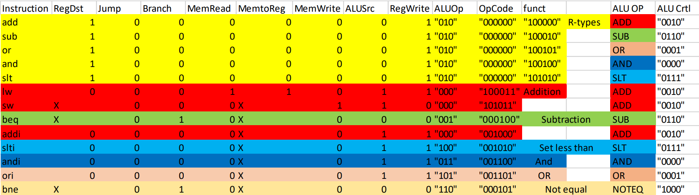

# Single-cycle 32-bit MIPS Processor Simulation Using Verilog
The project was an assignment from the "Computer Architecture" university course. A simple single-cycle 32-bit processor based on the MIPS architecture is implemented using Verilog.
## Architecture and Modules
The implemented processor is based on the following diagram with some additional modifications.

Here are the implemented verilog modules and their respective roles:
- **ALU**: Arithmetic logic unit, providing the following operations:
  - AND
  - OR
  - ADD
  - SUB
  - SLT
  - NOTEQ
- **AddOnlyALU**: An add only ALU, used for PC and Branch
- **ALUControl**: A control unit for the ALU. Accepts a 3-bit ALUOp as the control signal.
- **Branch2Shift**: Shifting utility for branching.
- **ControlUnit**: Main control unit of the CPU.
- **Core**: The top-level module, which initiates all the modules and connects the data pathways. Provides the clock signal.
- **DataMemory**: Word-addressed 128 words long data memory. 7-bit address.
- **InstructionMemory**: 128x32 Byte-addressed instruction memory.
- **Jump2Shift**: Shifting utility for jump.
- **NBitMux**
- **PC**: Program counter.
- **RegisterFile**: The register file providing 32x32-bit registers.
- **SignExtender**: Utility for sign extending a 16-bit input to a 32-bit output.

## Instructions
The following instructions are supported by the processor:
- **I-Type**:
  - sw
  - lw
  - add
  - slti
  - andi
  - ori
  - beq
  - bne
- **R-Type**:
  - add
  - sub
  - or
  - and
  - slt
- **J-Type**: j

## Usage
### Hard-coded instructions
In order to run a set of instructions (a program) on the processor, the instructions must be hard-coded inside the **InstructionMemory** module. The current hard-coded example is a program that finds the minimum and the maximum of an array.

    module InstructionMemory (read_addr, instruction, reset);
        .
        .
        .
        always @(posedge reset)
        begin
            /*
            assuming we have an array with size 10 in the memory with base address 0
            addi $t0, $zero, a_big_number; $t0 will hold the minimum
            addi $t1, $zero, 0; $t1 will hold the maximum
            addi $t2, $zero, 0; $t2 will act as the array pointer
            lw $t3, 0($t2); load an item from array
            slt $t4, $t3, $t0; if item is less than minimum
            beq $t4, $zero, +1; if not, bypass next instruction
            add $t0, $zero, $t3; move item to $t0 as the new minimum
            slt $t4, $t1, $t3; if maximum is less than item
            beq $t4, $zero, +1; if not, bypass next instruction
            add $t1, $zero, $t3; move item to $t1 as the new maximum

            addi $t2, $t2, 1; $t2++
            slti $t4, $t2, 10;
            bne $t4, $zero, -10;
            sw $t0, 0($t2); store minimum
            sw $t1, 1($t2); store maximum
            */
            Imemory[0] = {6'b001000, 5'b00000, 5'b01000, 16'b0111111111111111}; // addi $t0, $zero, a_big_number
            Imemory[1] = {6'b001000, 5'b00000, 5'b01001, 16'b0000000000000000}; // addi $t1, $zero, 0
            Imemory[2] = {6'b001000, 5'b00000, 5'b01010, 16'b0000000000000000}; // addi $t2, $zero, 0
            Imemory[3] = {6'b100011, 5'b01010, 5'b01011, 16'b0000000000000000}; // lw $t3, 0($t2)
            Imemory[4] = {6'b000000, 5'b01011, 5'b01000, 5'b01100, 5'b00000, 6'b101010}; // slt $t4, $t3, $t0
            Imemory[5] = {6'b000100, 5'b01100, 5'b00000, 16'b0000000000000001}; // beq $t4, $zero, +1
            Imemory[6] = {6'b000000, 5'b00000, 5'b01011, 5'b01000, 5'b00000, 6'b100000}; // add $t0, $zero, $t3
            Imemory[7] = {6'b000000, 5'b01001, 5'b01011, 5'b01100, 5'b00000, 6'b101010}; // slt $t4, $t1, $t3
            Imemory[8] = {6'b000100, 5'b01100, 5'b00000, 16'b0000000000000001}; // beq $t4, $zero, +1
            Imemory[9] = {6'b000000, 5'b00000, 5'b01011, 5'b01001, 5'b00000, 6'b100000}; // add $t1, $zero, $t3
            Imemory[10] = {6'b001000, 5'b01010, 5'b01010, 16'b0000000000000001}; // addi $t2, $t2, 1
            Imemory[11] = {6'b001010, 5'b01010, 5'b01100, 16'b0000000000001010}; // slti $t4, $t2, 10
            Imemory[12] = {6'b000101, 5'b01100, 5'b00000, 16'b1111111111110110}; // bne $t4, $zero, -10
            Imemory[13] = {6'b101011, 5'b01010, 5'b01000, 16'b0000000000000000}; // sw $t0, 0($t2)
            Imemory[14] = {6'b101011, 5'b01010, 5'b01001, 16'b0000000000000001}; // sw $t1, 1($t2)
        end
    endmodule

### Hard-coded Inputs
The required inputs of a program also needs to be hard-coded inside the DataMemory module.

    module DataMemory (addr, write_data, read_data, clk, reset, MemRead, MemWrite, display);
        .
        .
        .
        always @(posedge clk or posedge reset or posedge display)
        begin
            .
            .
            .
            if (reset == 1'b1)
                begin
                    for (k=0; k<128; k=k+1) begin
                        DMemory[k] = 32'b0;
                    end
                    DMemory[0] = 5;
                    DMemory[1] = 1;
                    DMemory[2] = 3;
                    DMemory[3] = 2;
                    DMemory[4] = 8;
                    DMemory[5] = 12;
                    DMemory[6] = 4;
                    DMemory[7] = 19;
                    DMemory[8] = 6;
                    DMemory[9] = 3;
                end
            else
                ...
        end
    endmodule

### Simulation Execution
By executing the following commands in the root directory of the project, you can compile the modules and run the simulation:

    iverilog -o processor -c module_list.txt
    vvp processor

> Note that the above commands use the **Icarus Verilog** tool on windows.

At the end of the simulation, a full dump of both the data memory and the register file will be printed on to the console.  
Example DataMemory dump at the end of simulation for the example program (finding the minimum and the maximum of an array):

## License
[MIT](https://choosealicense.com/licenses/mit/)